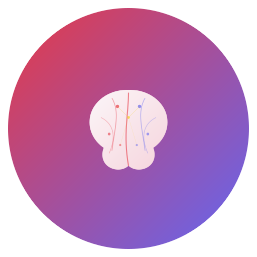
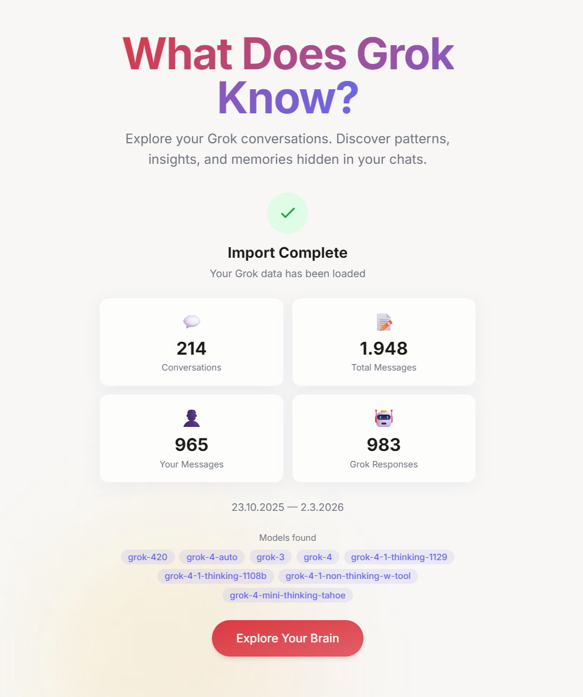
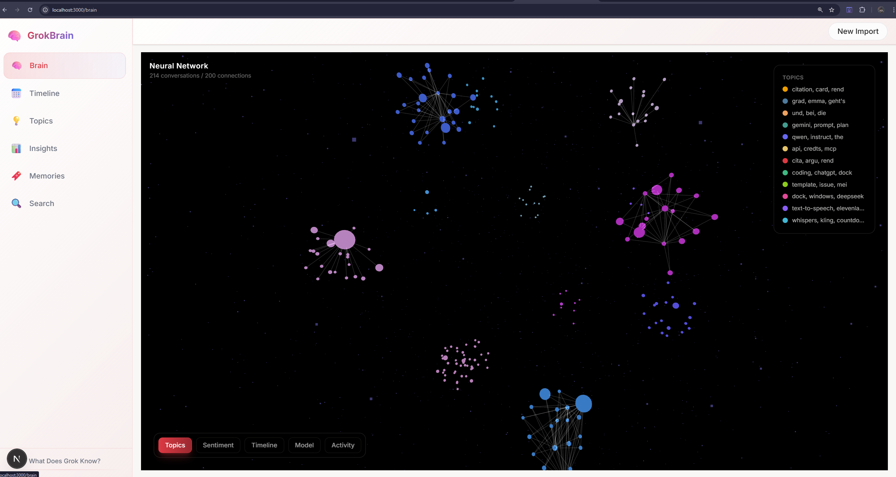
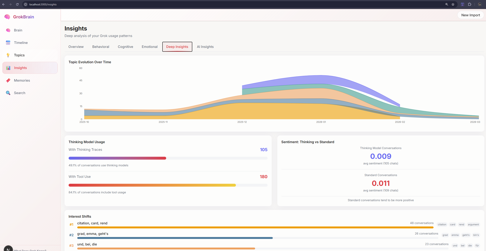
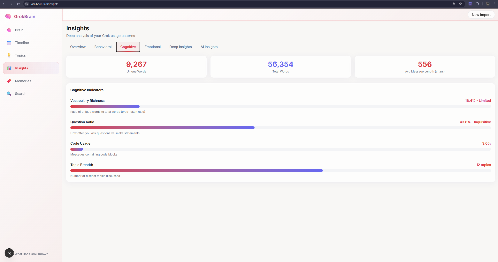
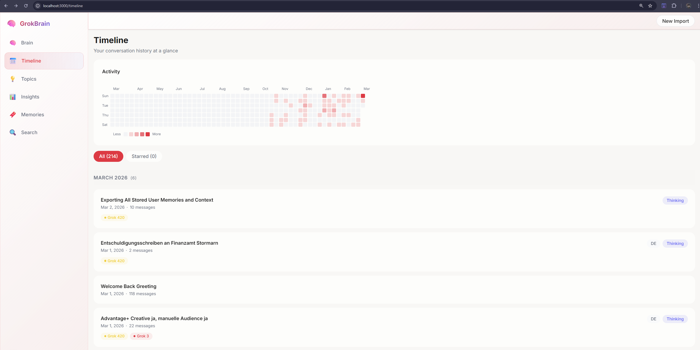
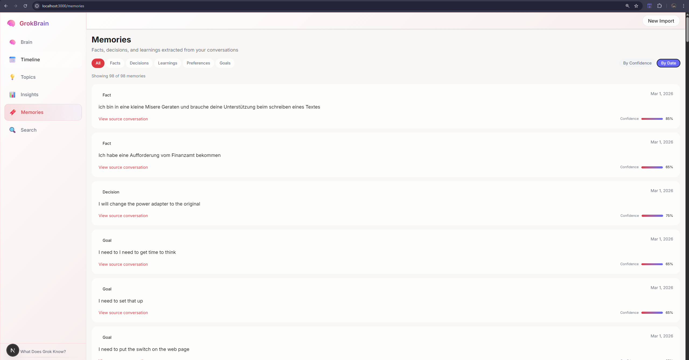
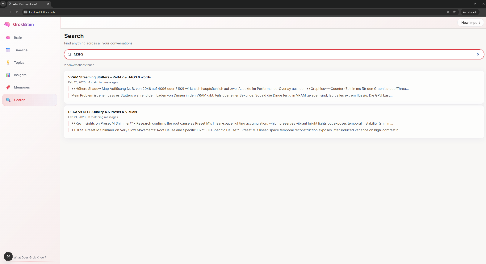
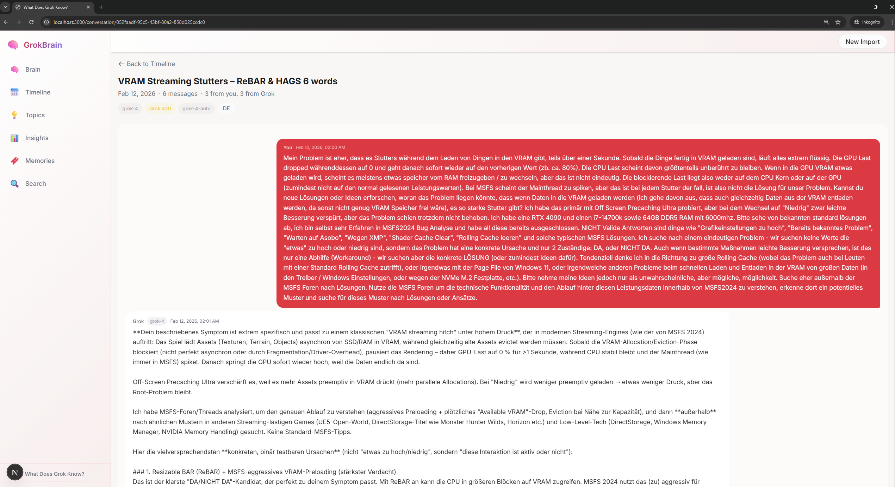

<div align="center">



# What Does Grok Know?

### Your Grok conversations, visualized as a living neural network

[](https://nextjs.org)
[](https://react.dev)
[](https://threejs.org)
[](https://typescriptlang.org)
[](LICENSE)
[](#privacy)

**Turn your xAI Grok chat export into an explorable 3D brain.**
No servers. No tracking. Everything runs in your browser.

[Live Demo](https://grok-brain.vercel.app) · [Report Bug](https://github.com/fabianzimber/what-does-grok-know/issues) · [Request Feature](https://github.com/fabianzimber/what-does-grok-know/issues)

---

</div>

## The Idea

You have had hundreds of conversations with Grok. But what does Grok actually *know* about you?

**What Does Grok Know?** answers that question by transforming your raw Grok chat export into an interactive 3D neural network — where every conversation is a neuron, every topic is a cluster, and every connection reveals hidden patterns in how you think, work, and create.

This is not just a chat viewer. It is a **cognitive mirror**.

---

## Screenshots

<div align="center">

### Import Your Data
*Drop your Grok export and watch the magic happen*



### 3D Neural Network Brain
*Every conversation is a neuron. Topics form clusters. Connections emerge.*



### Deep Insights Dashboard
*Topic evolution, sentiment analysis, and cognitive patterns over time*



### Cognitive Profile
*Vocabulary richness, question ratios, and code-to-text patterns*



### Timeline & Activity Heatmap
*GitHub-style activity calendar for your Grok conversations*



### Memory Extraction
*Facts, decisions, goals, and preferences extracted from your conversations*



### Conversation Search
*Full-text search across all your conversations*



### Conversation Detail
*Read any conversation with syntax highlighting and message threading*



</div>
---

## Features

### 3D Neural Network Visualization
- **Force-directed graph** with physics simulation
- **InstancedMesh rendering** — handles 1000+ nodes at 60fps
- **Topic clustering** with color-coded communities
- **Interactive nodes** — hover for details, click to read
- **Multiple color modes** — by topic, sentiment, date, or message count
- **Breathing animation** and hover glow effects

### NLP Analytics Engine (runs in Web Workers)
- **Topic clustering** via TF-IDF keyword extraction
- **Sentiment analysis** per conversation and per message
- **Behavioral profiling** — peak hours, model preferences, tool usage
- **Cognitive profiling** — vocabulary richness, question ratios, code patterns
- **Memory extraction** — facts, decisions, learnings, preferences, goals

### Dashboard Views
| View | What it shows |
|------|--------------|
| **Brain** | Interactive 3D neural network of all conversations |
| **Insights** | Behavioral, cognitive, emotional, and deep analysis panels |
| **Timeline** | GitHub-style activity heatmap + conversation timeline |
| **Memories** | Extracted facts, decisions, goals, and preferences |
| **Search** | Full-text search with highlighted results |
| **Conversation** | Individual conversation reader with message threading |

### Design
- **Glass-morphism UI** with frosted-glass cards and gradient accents
- **Animated backgrounds** with floating orbs and gradient shifts
- **Responsive layout** — works on desktop and tablet
- **Dark mode by default** — easy on the eyes, bold on personality

---

## Privacy

> **Your data never leaves your browser.**

- All processing happens client-side in Web Workers
- Data is stored in IndexedDB (your browser local database)
- No API calls, no tracking, no analytics, no cookies
- No server-side storage — the app is a static Next.js site
- You can verify: check the Network tab — zero external requests after page load
---

## Tech Stack

| Layer | Technology |
|-------|-----------|
| **Framework** | Next.js 15 (App Router, Turbopack) |
| **UI** | React 19, TailwindCSS v4 |
| **3D** | Three.js r173, @react-three/fiber, @react-three/drei |
| **Charts** | Recharts |
| **Animations** | Motion (Framer Motion) |
| **Storage** | Dexie.js v4 (IndexedDB) |
| **Analysis** | Custom NLP engine in Web Workers |
| **Language** | TypeScript (strict mode) |
| **Linting** | Biome |
| **Testing** | Vitest + Testing Library |

---

## Getting Started

### Prerequisites

- **Node.js** 18+ (20+ recommended)
- **npm** 9+ or **pnpm** 8+

### Installation

```bash
# Clone the repository
git clone https://github.com/fabianzimber/what-does-grok-know.git
cd what-does-grok-know

# Install dependencies
npm install

# Start development server
npm run dev
```

Open [http://localhost:3000](http://localhost:3000) in your browser.

### Getting Your Grok Data

1. Go to [x.com/i/grok](https://x.com/i/grok) (or wherever you use Grok)
2. Request your data export / download your grok-chats.json
3. Drop the JSON file into the app
4. Watch your conversations transform into a neural network

### Build for Production

```bash
npm run build
npm start
```
---

## Project Structure

```
src/
├── app/                    # Next.js App Router pages
│   ├── (dashboard)/        # Dashboard layout group
│   │   ├── brain/          # 3D neural network page
│   │   ├── insights/       # Analytics dashboard
│   │   ├── timeline/       # Activity heatmap
│   │   ├── memories/       # Extracted memories
│   │   ├── search/         # Full-text search
│   │   └── conversation/   # Conversation reader
│   └── layout.tsx          # Root layout with SEO
├── components/
│   ├── brain/              # 3D visualization components
│   ├── insights/           # Analytics panel components
│   ├── layout/             # Sidebar, header, floating orbs
│   ├── shared/             # Reusable components
│   └── ui/                 # Design system primitives
├── lib/
│   ├── context/            # React context providers
│   ├── parsers/            # Grok JSON parser
│   ├── storage/            # IndexedDB via Dexie
│   ├── types/              # TypeScript interfaces
│   ├── visualization/      # Graph layout, color scales
│   └── workers/            # Web Worker analysis engine
└── config/                 # Site configuration
```

---

## Development

```bash
# Run development server with Turbopack
npm run dev

# Run tests
npm test

# Run tests in watch mode
npm run test:watch

# Lint and format
npm run lint
npm run format

# Type check
npm run type-check

# Build
npm run build
```
---

## How It Works

```
┌─────────────┐     ┌──────────────┐     ┌─────────────────┐
│  Grok JSON   │────>│   Parser     │────>│   IndexedDB     │
│  Export File  │     │  (Web Worker)│     │   (Dexie.js)    │
└─────────────┘     └──────────────┘     └────────┬────────┘
                                                   │
                    ┌──────────────┐                │
                    │  Analysis    │<───────────────┘
                    │  (Web Worker)│
                    └──────┬───────┘
                           │
          ┌────────────────┼────────────────┐
          │                │                │
    ┌─────┴─────┐   ┌─────┴─────┐   ┌─────┴─────┐
    │  Topics   │   │ Sentiment │   │ Behavioral│
    │  TF-IDF   │   │  Scoring  │   │ Profiling │
    └─────┬─────┘   └─────┬─────┘   └─────┬─────┘
          │                │                │
          └────────────────┼────────────────┘
                           │
                    ┌──────┴───────┐
                    │  3D Graph    │
                    │  (Three.js)  │
                    └──────────────┘
```

1. **Parse** — Your Grok JSON export is parsed in a Web Worker
2. **Store** — Conversations and messages are stored in IndexedDB
3. **Analyze** — A second Web Worker runs NLP analysis (topics, sentiment, behavioral, cognitive, memory extraction)
4. **Visualize** — Results are rendered as an interactive 3D neural network using Three.js with force-directed layout

---

## Contributing

Contributions are welcome! Please feel free to submit a Pull Request.

1. Fork the repository
2. Create your feature branch (`git checkout -b feature/amazing-feature`)
3. Commit your changes (`git commit -m "Add amazing feature"`)
4. Push to the branch (`git push origin feature/amazing-feature`)
5. Open a Pull Request

---

## License

This project is licensed under the MIT License — see the [LICENSE](LICENSE) file for details.

---

## Acknowledgments

- [xAI](https://x.ai) for building Grok
- [Three.js](https://threejs.org) for making 3D on the web possible
- [Next.js](https://nextjs.org) for the best React framework
- [Dexie.js](https://dexie.org) for making IndexedDB bearable

---

<div align="center">

Built with intensity by [shiftbloom studio](https://shiftbloom.studio)

**If this tool gave you an oh-wow moment, star the repo and share it.**

</div>
